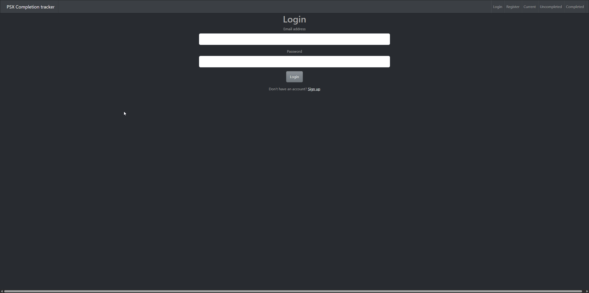
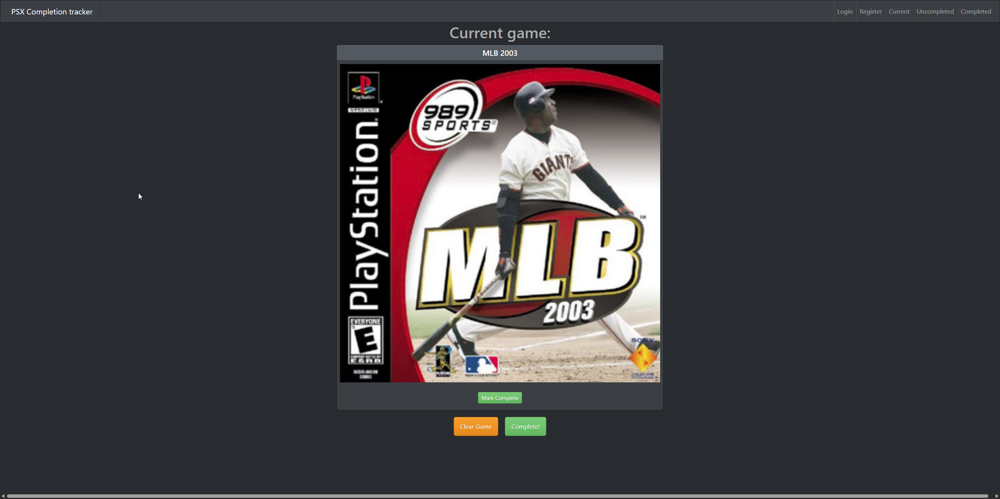

# PSX Completion Tracker — Client

React single-page app for browsing and updating completion status across a ~1,400-game PlayStation (PSX) library. Talks to the [PSX Completion Tracker server](https://github.com/cudaman73/psx-completion-server).

**Stack:** React 18 · React Router 6 · React Bootstrap · Context API · Vite

## Features

- Browse completed / uncompleted game lists with box art
- Toggle a game's completion status
- Set and display the "currently playing" game
- Register / log in, with protected routes gated behind auth

## Screenshots






## Architecture

- **AuthContext + AuthContextProvider** — global auth state via the Context API
- **ProtectedRoute** — wraps private routes and revalidates the session against `GET /session` on load, redirecting unauthenticated users to login
- **Components** — `Card`, `List`, `navbar`, `currentGame`; pages `Home`, `Completed`, `Uncompleted`, `Login`, `Register`
- Dev server proxies API requests to the backend at `http://localhost:3001`

## Running locally

Requires Node 18+ (works on Node 24) and the server running on port 3001.

```bash
npm install
npm run dev      # http://localhost:3000
```

## Status

Personal project (2023) built to deepen React + authentication fundamentals. Pairs with the server repo for a full MERN stack. Migrated from Create React App to Vite (2026) so it builds and runs on current Node versions.
